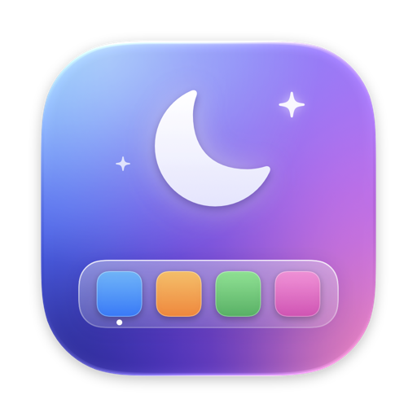
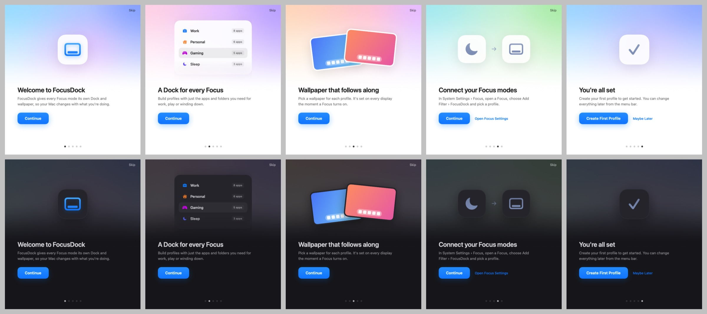

<p align="center"></p>

<h1 align="center">FocusDock</h1>

<p align="center">Give every Focus on your Mac its own Dock and its own wallpaper.</p>

FocusDock is a menu bar app. When a Focus turns on, it swaps your Dock apps, Dock folders and wallpaper for the ones you picked for that Focus. When the Focus ends, your usual setup comes back.



## Features

- **A Dock per Focus.** Each profile holds its own Dock apps and folders, in your order. Start from what's in your Dock right now and tick only the ones you want.
- **Wallpaper that follows along.** Choose an image, use your current wallpaper, or drop any image onto the profile. It's set on every display.
- **Three ways to switch.** A Focus Filter in System Settings, by hand from the menu bar, or the **Apply FocusDock Profile** action in Shortcuts.
- **Make it yours.** Give each profile a colour and an icon. The menu bar panel and editor take on its tint.
- **Private.** No account, no analytics, no network access. Everything stays on your Mac.

## Requirements

- macOS 15 Sequoia or later
- Xcode 16 or later, to build it

## Install

There's no notarized download yet, so either build it yourself or allow the downloaded app in System Settings.

### Build it yourself (recommended)

1. Clone this repo and open `FocusDock.xcodeproj` in Xcode.
2. Select the **FocusDock** target › **Signing & Capabilities** and choose your own **Team**. A free Apple ID (Personal Team) works.
   Focus Filters only load from apps signed with a team, so an unsigned build will run but won't appear in Focus settings.
3. Press **Run**, or build from Terminal:

   ```bash
   xcodebuild -project FocusDock.xcodeproj -target FocusDock -configuration Release SYMROOT="$PWD/build" DEVELOPMENT_TEAM=<your team ID> build
   ```

4. Copy `build/Release/FocusDock.app` to `/Applications` and open it once so macOS registers its Focus Filter.

### Use a downloaded copy

If you download a built `FocusDock.app` (from Releases), macOS will block it the first time because it isn't notarized:

1. Move `FocusDock.app` to `/Applications` and open it. macOS says it can't verify the developer. Click **Done**.
2. Open **System Settings › Privacy & Security**, scroll down to the message about FocusDock and click **Open Anyway**.
3. Confirm with your password. After that it opens normally.

## Set up

The first launch walks you through these steps.

1. Click the FocusDock icon in the menu bar, then the gear › **Edit Profiles…**, and click **New Profile** (for example "Work").
2. Under **Dock**, use **Add from Current Dock…** or **Add Apps…** / **Add Folders…**. Drag rows to reorder them.
3. Under **Wallpaper**, choose an image or drop one onto the card.
4. On the profile you want back when a Focus ends, turn on **Use when no Focus is on**.
5. In **System Settings › Focus**, open a Focus, choose **Add Filter › FocusDock**, and pick the profile.
6. Repeat for each Focus.

You can also apply profiles by hand from the menu bar, or with the **Apply FocusDock Profile** action in Shortcuts. To see the welcome screens again, use the gear › **Show Welcome…**.

## How it works

- The Dock is changed through the `com.apple.dock` preferences, then the Dock restarts (a short flicker), the same way `dockutil` does. That's why the app isn't sandboxed.
- A profile with no apps and no folders never touches your Dock, so an unfinished profile can't empty it.
- The wallpaper is set on every display, for the current Space only (a macOS limitation).
- Profiles are stored in `~/Library/Application Support/FocusDock/profiles.json`.

## License

[MIT](LICENSE)
